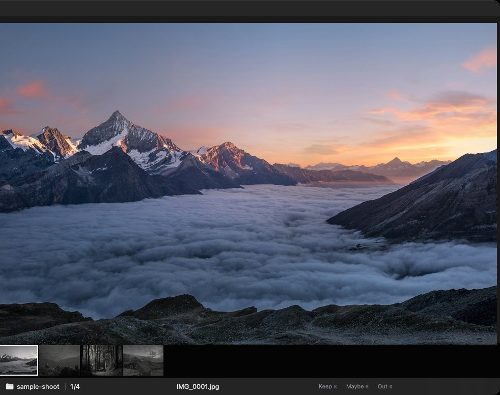

# Hayate

ただひたすら RAW データを選別するためのアプリ．
時間とって編集アプリで選別→編集のワークフローが結構しんどいから，とりあえず選別だけでもさくっとできるものを作ってみた．

  

現状 MacOS のみ...

## こんな人向け

- とりあえず選別だけサクッとしたい人

## ざっくりできること

キーボードで写真選別→書き出しが高速にできます。
その他は必要に応じて付け足します．

## 入れ方

[Releases](../../releases) から `.zip` を落として、`Hayate.app` を Applications へ。

気に入ってくれて、余裕があれば [Buy Me a Coffee](https://buymeacoffee.com/naotok705) でコーヒーをおごってもらえるとうれしいです（任意です）。Hayate 自体は無料です。

## 動作環境

- macOS 14 以降
- Metal 対応 GPU

## 対応フォーマット

CR3, CR2, NEF, ARW, DNG など CIRAWFilter が読める RAW。  
JPEG のみの写真も出ます（RAW+JPEG ペアは RAW 側だけ一覧にします）。

## ライセンス

MIT

---

# Hayate

Just for culling RAW. That’s it.

Spending a long session in an editor just to pick keeps, then edit — that workflow gets tiring. So I made something that at least gets the culling done quickly.

  

macOS only for now...

## Who it’s for

- People who just want to cull, quickly

## What it does

Keyboard culling → export, fast.  
I’ll add more if it turns out to be needed.

## Install

Grab the `.zip` from [Releases](../../releases) and put `Hayate.app` in Applications.

Hayate is free. If you like it and feel like it, you can [buy me a coffee](https://buymeacoffee.com/naotok705) — optional.

## Requirements

- macOS 14 or later
- Metal-compatible GPU

## Formats

CR3, CR2, NEF, ARW, DNG, and other RAW formats CIRAWFilter can read.  
JPEG-only shots show up too (for RAW+JPEG pairs, only the RAW is listed).

## License

MIT
